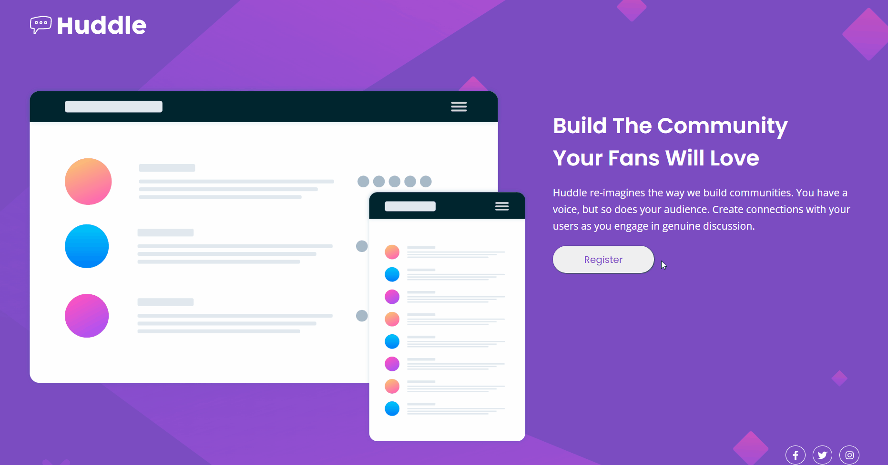

# Frontend Mentor - Solução para a página inicial do Huddle

Esta é uma solução para o desafio Huddle do Frontend Mentor. [Huddle landing page with single introductory section challenge on Frontend Mentor](https://www.frontendmentor.io/challenges/huddle-landing-page-with-a-single-introductory-section-B_2Wvxgi0).


### O Desafio

Consiste em criar uma página onde o usuário poderá visualizar o melhor layout dependendo do tamanho de tela de seu dispositivo, além de observar como os elementos da página interagem ao estado de foco.

### Screenshot




### Feito com

[](https://code.visualstudio.com/)
[](https://developer.mozilla.org/pt-BR/docs/Web/HTML)
[](https://developer.mozilla.org/pt-BR/docs/Web/CSS)

### Aprendizados

Neste projeto eu pude praticar, principalmente, como deixar o layout responsivo e também como posicionar os elementos na tela utilizando Flexbox e CSS Grid.

```css
.about {
    display: grid;
    grid-template-columns: 60% 40%;
}

@media(max-width: 786px) {
    .about {
       display: flex;
       flex-direction: column;
    }
}

```

### Desenvolvimento Contínuo

Esse teste foi dasafiador e percebi que ainda há muito para aprender sobre responsividade, Flexbox e CSS Grid.

### Author

- Frontend Mentor - [@raquesales](https://www.frontendmentor.io/profile/raquesales)


